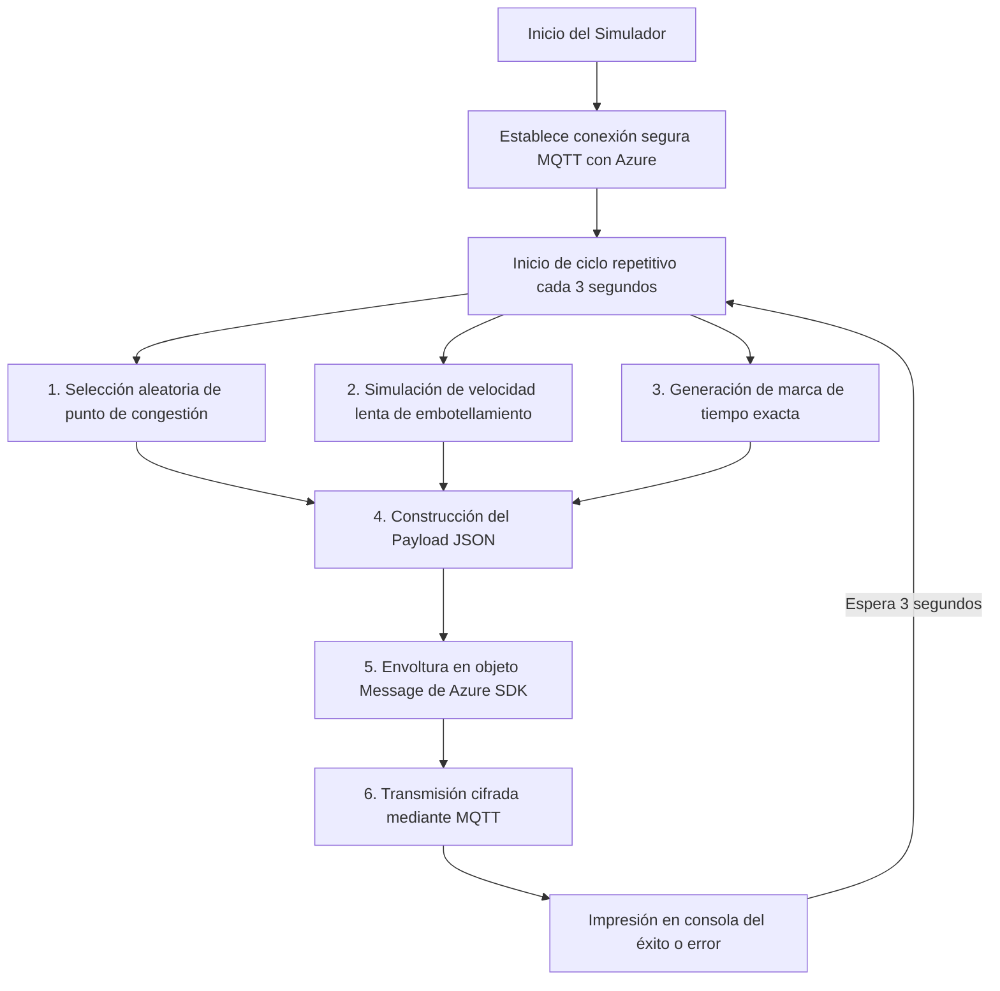

# 🚦 Simulador de Tráfico de Medellín - Telemetría Azure IoT Hub

Este proyecto contiene un **simulador de tráfico en Node.js** diseñado específicamente para recrear el flujo de datos de sensores de movilidad en la ciudad de **Medellín, Colombia**. Su propósito principal es alimentar de forma continua un hub de servicios en la nube (como Azure IoT Hub) con eventos simulados que representen condiciones reales de congestión vehicular.

---

## 🔍 ¿Qué hace exactamente este simulador?

El simulador recrea el comportamiento de un **sensor IoT inteligente de tráfico** instalado en las vías de Medellín. Su funcionamiento se basa en las siguientes etapas clave:



---

## 🛠️ Explicación de la Lógica del Código (`simulador.js`)

El corazón del proyecto es el archivo `simulador.js`. A continuación se detalla cómo opera internamente:

### 1. Gestión de Conectividad Segura
El script no guarda claves expuestas. Utiliza el módulo `dotenv` para leer la variable de entorno `CONNECTION_STRING` desde un archivo local `.env`. 
Con esta cadena de conexión, el SDK de Azure (`azure-iot-device` y `azure-iot-device-mqtt`) inicializa un cliente IoT seguro que se comunica mediante el protocolo **MQTT** (Message Queuing Telemetry Transport) sobre TLS/SSL.

### 2. Puntos Geográficos Reales de Medellín
Para que la simulación sea realista, el código define un arreglo de coordenadas de **10 puntos críticos de tráfico** en Medellín:
- **Latitudes y Longitudes preestablecidas** correspondientes a sectores de alta congestión como:
  - Zonas aledañas al **Tecnológico de Antioquia (TdeA)** y el **Politécnico Jaime Isaza Cadavid**.
  - Av. El Poblado (Milla de Oro).
  - Avenida Oriental y el Centro de la ciudad.
  - Laureles y la Avenida 80.
  - Sectores de la Autopista Sur y Autopista Norte.

### 3. Generación de Telemetría Realista (`sendTrafficData`)
Cada **3 segundos**, el simulador ejecuta una función recurrente que realiza tres tareas automáticas:

1. **Ubicación Aleatoria:** Selecciona al azar uno de los 10 puntos de congestión de Medellín almacenados. Esto simula que múltiples reportes de tráfico provienen de diferentes puntos críticos de la red vial.
2. **Cálculo de Velocidad (Congestión):** Genera una velocidad aleatoria en un rango de **5 km/h a 14 km/h** mediante la fórmula `Math.random() * (15 - 5) + 5`. Este rango tan bajo representa fielmente un escenario de congestión severa o embotellamiento ("taco").
3. **Marca de Tiempo Real:** Obtiene la hora y fecha exacta del sistema en formato ISO UTC para registrar el momento preciso del evento.

### 4. Empaquetado y Envío
Todos estos datos se estructuran en formato JSON:

```json
{
  "sensorId": "sensor-tdea-01",
  "velocidad": 8,
  "location": {
    "lat": 6.2108,
    "lng": -75.5735
  },
  "timestamp": "2026-05-20T21:30:00.000Z"
}
```

* **`sensorId`**: Identifica al sensor virtual que emite el reporte (`sensor-tdea-01`).
* **`velocidad`**: Velocidad registrada del flujo vehicular (en km/h).
* **`location`**: Posición geográfica exacta (Latitud y Longitud) del punto de medición.
* **`timestamp`**: Estampa de tiempo exacta del registro.

El payload se encapsula en una clase especial `Message` suministrada por el SDK de Azure y se envía de forma asíncrona mediante `client.sendEvent(mensaje)`. Si la transmisión tiene éxito, la consola imprime el JSON enviado; de lo contrario, captura y reporta el error detallado de red.

---

## 🎯 Caso de Uso en la Vida Real

En un entorno de producción o proyecto de **Ciudades Inteligentes (Smart Cities)**, este simulador sustituye temporalmente a los sensores físicos en la vía pública. Los datos enviados a **Azure IoT Hub** son comúnmente consumidos por:

1. **Azure Stream Analytics:** Para analizar velocidades promedio en tiempo real.
2. **Azure Functions / Event Hubs:** Para alertar si la velocidad promedio cae por debajo de 5 km/h (alerta de embotellamiento).
3. **Power BI / Dashboards de React:** Para mostrar un mapa interactivo de Medellín con puntos calientes (Heatmaps) que cambien de color según el estado del tráfico reportado por el simulador.
